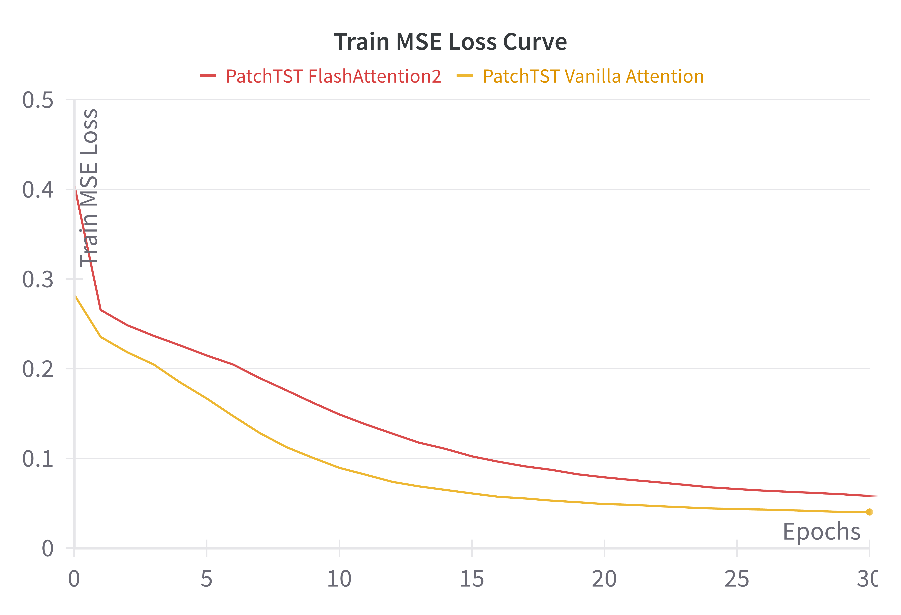
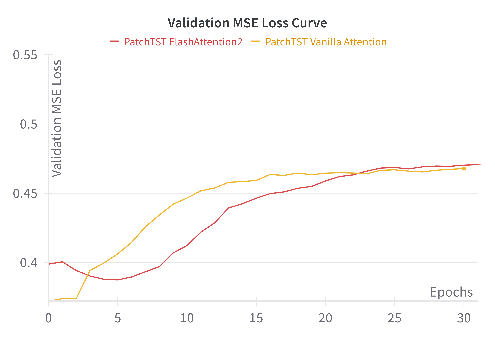

# HPML Project: PatchTST and FlashAttention2 Benchmarking

### Project Description
This repository contains an implementation of the PatchTST model using both vanilla attention and FlashAttention2. We provide a detailed comparative analysis assessing performance metrics like dataloading time and computation time, loss, and accuracy. Our results indicate that FlashAttention2, when integrated into the PatchTST architecture, enhances performance over the traditional vanilla attention. Additionally, we investigate various pruning methods to optimize these attention mechanisms efficiently. The experiments with head-specific pruning suggest ways to reduce computational demands while maintaining model effectiveness. This work highlights the advantages of advanced attention mechanisms and pruning techniques in improving efficiency and performance in time series forecasting.

### Outline of Repository


### Installation
**Clone the project**
``` 
git clone https://github.com/divyatadimeti/patchtst_flashattention.git
```
**Install requirements**
Make sure to set up the local environment with the correct python version (3.9 >= v >= 3.11) and install the requirements. We use Python 3.10 in our experiments. Additionally, FlashAttention requires CUDA 11.6 and can only currently be run on a specific list of compatible GPUs.

From the official documentation, FlashAttention2 currently supports Ampere, Ada, or Hopper GPUs (e.g., A100, RTX 3090, RTX 4090, H100). Support for Turing GPUs (T4, RTX 2080) is coming soon, please use FlashAttention 1.x for Turing GPUs for now.
```
conda create -n pflash python==3.10
pip install -r requirements.txt
```

**Clone the tsfm repository**
We use IBM's tsfm repository to access the PatchTST models. Clone the repository using the following command and follow the set up instructions in the README.md of the GitHub:
```
git clone https://github.com/IBM/tsfm.git
cd tsfm
pip install ".[notebooks]"
```

**Install FlashAttention2**
We use the official code from the FlashAttention repository to run PatchTST with FlashAttention2. It can be installed using the below command:
```
pip install -U flash-attn --no-build-isolation
```

### Download the Datasets
**Download the ETDataset and the Traffic dataset**
We use the official ETDataset and Traffic datasets that are commonly used to train time-series models. The ETT datasets can be downloaded with the following commands:
```
wget -O data/ETTh1.csv https://github.com/zhouhaoyi/ETDataset/raw/main/ETT-small/ETTh1.csv
wget -O data/ETTm1.csv https://github.com/zhouhaoyi/ETDataset/raw/main/ETT-small/ETTm1.csv
```
The Traffic dataset can be installed by creating an account with Caltrans PeMS and downloading the data from the website: https://dot.ca.gov/programs/traffic-operations/mpr/pems-source.

### Running the Code
**Config file**
The configuration in `config.yaml` has been provided as a default to run PatchTST with Vanilla and FlashAttention. To change which model is being used, ensure that `attn_type` under the `model` parameters is set to be either `vanilla` or `flash`. Modify any other hyperparameters, experimental parameters, data paths, and logging parameters from the configuration file before running the code.

**Experiments**
The model can be trained using the following command. Use the `--help` flag to display the experiment set up configurations. Custom configuration files can be specified with a flag.
```
python run.py
```
By default, the above command while run the main driver with the configurations in `config.yaml`. To run experiments using mini hyperparameter sweeps as outlined in our paper with patch size, batch size, datasets and number of workers, utilize the appropriate flags: `--patch_size_exp`, `--batch_size_exp`, `--num_workers_exp`.


## Results

We evaluated the PatchTST model with both vanilla attention and FlashAttention2 using the ETTm1 dataset. Below are the key findings:

### MSE Losses Comparison

Both models were compared based on MSE losses across training, validation, and test datasets:

- Training and validation losses were similar between the models, but PatchTST with FlashAttention2 showed slightly higher losses than vanilla attention.
- On the ETTh1 dataset, FlashAttention2 showed lower test MSE loss, indicating better performance in smaller datasets.

#### Loss Plots

*Train MSE Loss for both models*


*Validation MSE Loss for both models*

### Batch Size Impact

We explored the effect of varying batch sizes on model performance. Increasing the batch size significantly decreased total time, especially for FlashAttention2.

#### Batch Size Performance
| Batch Size | Vanilla Attention Total Time | FlashAttention2 Total Time |
|------------|------------------------------|----------------------------|
| 512        | 14.4820 sec                  | 11.0030 sec                |
| 256        | 14.7140 sec                  | 11.3420 sec                |
| 128        | 15.7120 sec                  | 12.2490 sec                |
| 64         | 17.6110 sec                  | 14.9090 sec                |
| 32         | 24.7230 sec                  | 23.2630 sec                |


*Total time speedup percentage for varying batch sizes*

### Patch Size Variation

Varying the patch size revealed that smaller patches enhanced the performance of FlashAttention2 more significantly than vanilla attention.

#### Patch Size Performance
| Patch Size | Vanilla Attention Total Time | FlashAttention2 Total Time |
|------------|------------------------------|----------------------------|
| 192        | 8.4250 sec                   | 8.7590 sec                 |
| 96         | 8.3870 sec                   | 8.7780 sec                 |
| 48         | 8.2530 sec                   | 8.5971 sec                 |
| 24         | 9.4820 sec                   | 8.5881 sec                 |
| 12         | 13.8270 sec                  | 10.1900 sec                |


*Total time speedup percentage for varying patch sizes*

### Worker Impact on Performance

Increasing the number of workers consistently reduced data loading times, enhancing overall performance, particularly for FlashAttention2.

#### Workers Performance
| Number of Workers | Vanilla Attention Total Time | FlashAttention2 Total Time |
|-------------------|------------------------------|----------------------------|
| 16                | 18.537 sec                   | 13.331 sec                 |
| 8                 | 15.280 sec                   | 10.782 sec                 |
| 4                 | 14.013 sec                   | 10.054 sec                 |
| 2                 | 13.961 sec                   | 10.178 sec                 |


*Total time speedup percentage for varying number of workers*

### Pruning Impact

Pruning experiments showed that dynamic pruning with 5 heads per layer resulted in significant improvements in speed and minimal impact on loss.

#### Pruning Results

*Validation MSE Loss for models with and without pruning*
