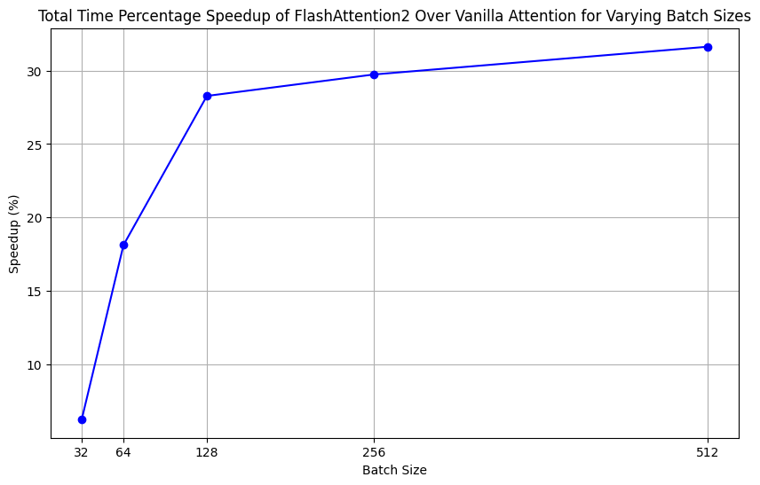
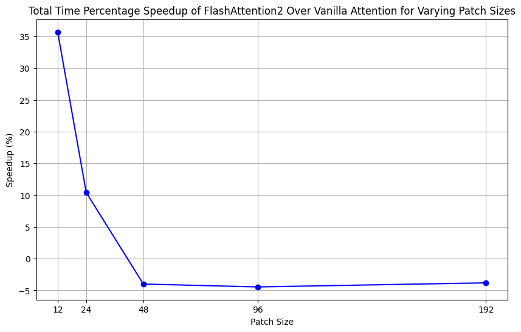
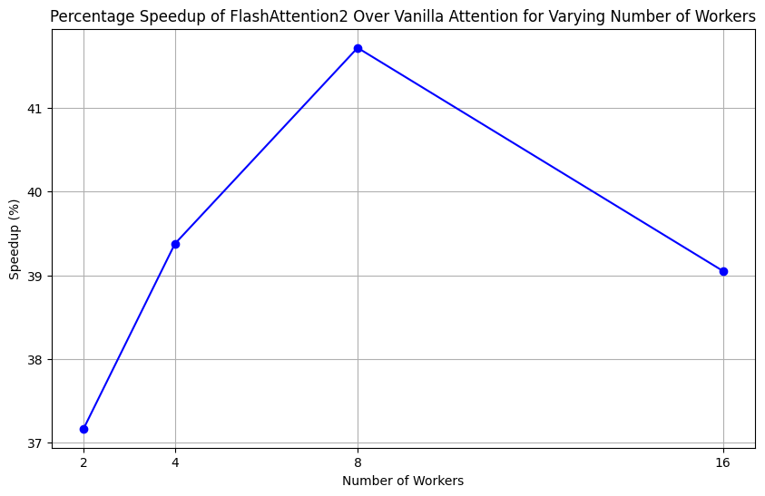
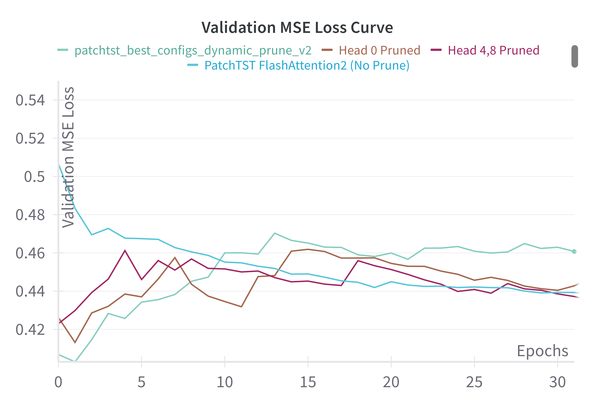

# HPML Project: PatchTST and FlashAttention2 Benchmarking

### Project Description
This repository contains an implementation of the PatchTST model using both vanilla attention and FlashAttention2. We provide a detailed comparative analysis assessing performance metrics like dataloading time and computation time, loss, and accuracy. Our results indicate that FlashAttention2, when integrated into the PatchTST architecture, enhances performance over the traditional vanilla attention. Additionally, we investigate various pruning methods to optimize these attention mechanisms efficiently. The experiments with head-specific pruning suggest ways to reduce computational demands while maintaining model effectiveness. This work highlights the advantages of advanced attention mechanisms and pruning techniques in improving efficiency and performance in time series forecasting.

### Outline of Repository


### Installation
**Clone the project**
``` 
git clone https://github.com/divyatadimeti/patchtst_flashattention.git
```
**Install requirements**
Make sure to set up the local environment with the correct python version (3.9 >= v >= 3.11) and install the requirements. We use Python 3.10 in our experiments. Additionally, FlashAttention requires CUDA 11.6 and can only currently be run on a specific list of compatible GPUs.

From the official documentation, FlashAttention2 currently supports Ampere, Ada, or Hopper GPUs (e.g., A100, RTX 3090, RTX 4090, H100). Support for Turing GPUs (T4, RTX 2080) is coming soon, please use FlashAttention 1.x for Turing GPUs for now.
```
conda create -n pflash python==3.10
pip install -r requirements.txt
```

**Clone the tsfm repository**
We use IBM's tsfm repository to access the PatchTST models. Clone the repository using the following command and follow the set up instructions in the README.md of the GitHub:
```
git clone https://github.com/IBM/tsfm.git
cd tsfm
pip install ".[notebooks]"
```

**Install FlashAttention2**
We use the official code from the FlashAttention repository to run PatchTST with FlashAttention2. It can be installed using the below command:
```
pip install -U flash-attn --no-build-isolation
```

### Download the Datasets
**Download the ETDataset and the Traffic dataset**
We use the official ETDataset and Traffic datasets that are commonly used to train time-series models. The ETT datasets can be downloaded with the following commands:
```
wget -O data/ETTh1.csv https://github.com/zhouhaoyi/ETDataset/raw/main/ETT-small/ETTh1.csv
wget -O data/ETTm1.csv https://github.com/zhouhaoyi/ETDataset/raw/main/ETT-small/ETTm1.csv
```
The Traffic dataset can be installed by creating an account with Caltrans PeMS and downloading the data from the website: https://dot.ca.gov/programs/traffic-operations/mpr/pems-source.

### Running the Code
**Config file**
The configuration in `config.yaml` has been provided as a default to run PatchTST with Vanilla and FlashAttention. To change which model is being used, ensure that `attn_type` under the `model` parameters is set to be either `vanilla` or `flash`. Modify any other hyperparameters, experimental parameters, data paths, and logging parameters from the configuration file before running the code.

**Experiments**
The model can be trained using the following command. Use the `--help` flag to display the experiment set up configurations. Custom configuration files can be specified with a flag.
```
python run.py
```
By default, the above command while run the main driver with the configurations in `config.yaml`. To run experiments using mini hyperparameter sweeps as outlined in our paper with patch size, batch size, datasets and number of workers, utilize the appropriate flags: `--patch_size_exp`, `--batch_size_exp`, `--num_workers_exp`.


## Results

We evaluated the PatchTST model with both vanilla attention and FlashAttention2 using the ETTm1 dataset. Below are the key findings:

### MSE Losses Comparison

Both models were compared based on MSE losses across training, validation, and test datasets:

- Training and validation losses were similar between the models, but PatchTST with FlashAttention2 showed slightly higher losses than vanilla attention.
- On the ETTh1 dataset, FlashAttention2 showed lower test MSE loss, indicating better performance in smaller datasets.

### Batch Size Impact

We explored the effect of varying batch sizes on model performance. Larger batch sizes decreased total time and compute time, enhancing efficiency, especially for FlashAttention2.

#### Batch Size Performance
| Batch Size | Compute Time (Vanilla) | Data Loading Time (Vanilla) | Total Time (Vanilla) | Compute Time (FlashAttention2) | Data Loading Time (FlashAttention2) | Total Time (FlashAttention2) |
|------------|------------------------|-----------------------------|----------------------|--------------------------------|--------------------------------------|------------------------------|
| 512        | 14.4731 sec            | 0.0089 sec                  | 14.4820 sec          | 10.9891 sec                    | 0.0139 sec                          | 11.0030 sec                  |
| 256        | 14.7092 sec            | 0.0048 sec                  | 14.7140 sec          | 11.3339 sec                    | 0.0081 sec                          | 11.3420 sec                  |
| 128        | 15.708 sec             | 0.0040 sec                  | 15.7120 sec          | 12.2438 sec                    | 0.0052 sec                          | 12.2490 sec                  |
| 64         | 17.608 sec             | 0.0030 sec                  | 17.6110 sec          | 14.9056 sec                    | 0.0034 sec                          | 14.9090 sec                  |
| 32         | 24.7207 sec            | 0.0023 sec                  | 24.7230 sec          | 23.2607 sec                    | 0.0023 sec                          | 23.2630 sec                  |


*Total time speedup percentage for varying batch sizes shows significant improvement with FlashAttention2, particularly at higher batch sizes.*

### Patch Size Variation

Varying the patch size revealed that smaller patches enhanced the performance of FlashAttention2 more significantly than vanilla attention.

#### Patch Size Performance
| Patch Size | Data Loading Time (Vanilla) | Compute Time (Vanilla) | Total Time (Vanilla) | Data Loading Time (FlashAttention2) | Compute Time (FlashAttention2) | Total Time (FlashAttention2) |
|------------|-----------------------------|------------------------|----------------------|--------------------------------------|--------------------------------|------------------------------|
| 192        | 0.0560 sec                 | 8.3690 sec             | 8.4250 sec           | 0.0490 sec                          | 8.7100 sec                     | 8.7590 sec                   |
| 96         | 0.0523 sec                 | 8.3347 sec             | 8.3870 sec           | 0.0430 sec                          | 8.7350 sec                     | 8.7780 sec                   |
| 48         | 0.0358 sec                 | 8.2172 sec             | 8.2530 sec           | 0.0368 sec                          | 8.5603 sec                     | 8.5971 sec                   |
| 24         | 0.0086 sec                 | 9.4734 sec             | 9.4820 sec           | 0.0196 sec                          | 8.5685 sec                     | 8.5881 sec                   |
| 12         | 0.0041 sec                 | 13.8229 sec            | 13.8270 sec          | 0.0089 sec                          | 10.1811 sec                    | 10.1900 sec                  |


*Performance improves with smaller patch sizes for FlashAttention2, demonstrating its efficiency in processing finer details faster.*

### Worker Impact on Performance

Increasing the number of workers consistently reduced data loading times, enhancing overall performance, particularly for FlashAttention2.

#### Workers Performance
| Number of Workers | Data Loading Time (Vanilla) | Compute Time (Vanilla) | Total Time (Vanilla) | Data Loading Time (FlashAttention2) | Compute Time (FlashAttention2) | Total Time (FlashAttention2) |
|-------------------|-----------------------------|------------------------|----------------------|--------------------------------------|--------------------------------|------------------------------|
| 16                | 0.0090 sec                  | 18.5280 sec            | 18.537 sec           | 0.0074 sec                          | 13.3236 sec                    | 13.331 sec                   |
| 8                 | 0.0045 sec                  | 15.2755 sec            | 15.280 sec           | 0.0047 sec                          | 10.7773 sec                    | 10.782 sec                   |
| 4                 | 0.0041 sec                  | 14.0089 sec            | 14.013 sec           | 0.0078 sec                          | 10.0462 sec                    | 10.054 sec                   |
| 2                 | 0.0046 sec                  | 13.9564 sec            | 13.961 sec           | 0.0085 sec                          | 10.1695 sec                    | 10.178 sec                   |


*Decreasing data loading times and increasing worker count significantly boosts performance, with FlashAttention2 showing the greatest benefits.*

### Pruning Impact

Pruning experiments showed that dynamic pruning with 5 heads per layer resulted in significant improvements in speed and minimal impact on loss.

#### Pruning Results

*Validation MSE Loss for models with and without pruning demonstrates that dynamic pruning maintains model efficacy while enhancing efficiency.*

#### Pruning Results


*Validation MSE Loss for models with and without pruning*


## Observations

### Performance Optimization
- **FlashAttention2 Efficiency**: FlashAttention2 consistently outperforms vanilla attention in handling high computational loads. Notably, at a batch size of 512, FlashAttention2 shows a 31.6% total time speedup compared to vanilla attention, excelling in large-scale data processing. Smaller patch sizes further amplify this effect, with up to a 35.7% speedup observed for a patch size of 12.
- **Optimization Limits**: Larger patch sizes (192 and 96) combined with large batch sizes introduce performance bottlenecks, likely due to memory bandwidth and computational overhead, highlighting the need for optimal configuration to maximize efficiency.

### Pruning Effects
- **Static Pruning**: Initial static pruning strategies, which included conservative and random pruning, did not significantly enhance computational speed but maintained model accuracy, suggesting a robust baseline for further pruning exploration.
- **Dynamic Pruning**: Dynamic pruning strategies, which involve iteratively removing less significant weights, improved performance efficiency with a 5.7% speedup. This points to the potential of more advanced pruning techniques to achieve even greater efficiency without sacrificing accuracy.

These insights demonstrate the potential of optimized attention mechanisms and pruning strategies to significantly enhance the efficiency and performance of time series forecasting models like PatchTST.

